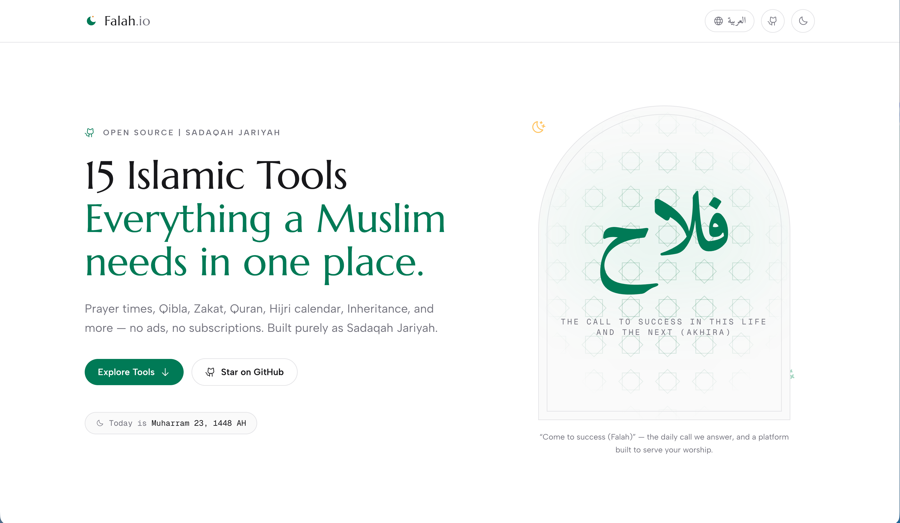

# 🌙 Falah.io — The Islamic Toolkit

[](https://github.com/abdessamadbettal/falah)
[](https://nextjs.org)
[](https://tailwindcss.com)
[](https://iconify.design)
[](https://falah.io)
[](https://falah.io)

> *"Come to prayer, come to success (Falah)."*  
> **Every Muslim deserves access to accurate Islamic tools without creating accounts, handing over location data, or hitting paywalls.**

**Falah.io** is an open-source, zero-tracking, ad-free suite of essential Islamic utilities. Built purely as **Sadaqah Jariyah** (continuous charity), everything runs client-side directly in your browser. No backend databases harvesting your GPS, no premium subscriptions, and no hidden monetization—just clean, modern, and accessible tools for the Ummah.



---

## ✨ Why Falah.io?

Most modern Islamic apps rely on invasive location tracking, aggressive ads, or locking basic religious necessities behind paywalls. **Falah is different by design:**

- 🔒 **Private & Client-Side:** All calculations (Prayer Times, Zakat, Qibla, and Inheritance) happen locally on your device — your location and financial inputs never leave your browser.
- 🚫 **Zero Ads & No Paywalls:** Faith should never be monetized. No advertisements, sponsored listings, or premium-only features.
- ⚡ **Offline-Ready & Lightning Fast:** Built with Next.js static architecture for excellent performance and offline capabilities.
- 🌍 **No Accounts Required:** Open the app and instantly access every feature without signing up.
- 🌐 **Multilingual Support:** Available in **English** and **Arabic (العربية)** with full right-to-left layout. French is on the roadmap.

---

# 🧰 The Toolkit

## ⏳ Time & Daily Worship

- **Prayer Times & Adhan**
  - Accurate prayer times for your location or any city worldwide.
  - Customizable Adhan notifications.

- **Hijri Smart Calendar**
  - Islamic calendar.
  - White Days (Ayyam al-Bid) reminders.
  - Calendar export support.

- **Ramadan Countdown**
  - Countdown to Ramadan.
  - Daily Ramadan companion.

- **Hijri ↔ Gregorian Converter**
  - Instant calendar conversion.

---

## 🧭 Direction & Local Community

- **Qibla Finder**
  - Compass-based Qibla direction.
  - Uses device sensors locally.

- **Mosque Finder**
  - Find nearby mosques and prayer spaces.
  - Uses browser geolocation only.

---

## 📖 Quran & Islamic Knowledge

- **Al-Qur'an Explorer**
  - Beautiful Quran reader.
  - Clean Arabic typography.

- **Tafseer Explorer**
  - Read explanations and commentary alongside verses.

- **99 Names of Allah**
  - Meanings.
  - Audio pronunciations.
  - Explanations.

- **Hisnul Muslim**
  - Authentic daily Duas.
  - Organized by category.

---

## 🧮 Islamic Calculators

- **Zakat Calculator**
  - Cash
  - Gold
  - Silver
  - Investments
  - Business assets
  - Live Nisab values

- **Islamic Inheritance Calculator (Fara'id)**
  - Accurate inheritance distribution.

- **Hijri Age Calculator**
  - Exact Hijri age.
  - Islamic milestone tracker.

---

## 🎨 Creative & Utility Tools

- **Quran Card Maker**
  - Generate beautiful Quran verse cards.
  - Share on social media.

- **Arabic Letterhead Date Stamp**
  - Professional Hijri date headers.
  - Islamic document stamps.

---

# 🛠️ Tech Stack

| Technology | Purpose |
|------------|---------|
| **Next.js 16** | React framework using Static Export for fast client-side performance |
| **Tailwind CSS** | Responsive modern UI with dark mode support |
| **Iconify** | Lightweight SVG icons |
| **HTML5 Geolocation** | Local-only mosque finding |
| **DeviceOrientation API** | Local-only Qibla direction |

---

# 🚀 Getting Started

## Prerequisites

- Node.js **20+**
- npm, pnpm, or yarn

## Installation

### 1. Clone the repository

```bash
git clone https://github.com/abdessamadbettal/falah.git
cd falah
```

### 2. Install dependencies

```bash
npm install

# or

pnpm install

# or

yarn install
```

### 3. Start the development server

```bash
npm run dev

# or

pnpm dev

# or

yarn dev
```

### 4. Open your browser

Visit:

```
http://localhost:3000
```

---

# 🤝 Contributing

Falah.io is a community-driven project built as **Sadaqah Jariyah**.

There are many ways to contribute:

- 💻 Submit code improvements.
- 🌐 Help translate the project (Arabic today — French is next).
- 🐞 Report bugs.
- 📖 Improve documentation.
- 📢 Share the project with others.

Pull Requests are always welcome — start with the **[Contributing Guide](CONTRIBUTING.md)**, which covers local setup, the pre-PR checklist, and a step-by-step recipe for adding a new tool or language.

---

# ❤️ Sadaqah Jariyah

This project will always remain:

- ✅ Open Source
- ✅ Privacy First (inputs stay on-device; anonymized analytics only)
- ✅ No Ads
- ✅ No Premium Tier
- ✅ No Selling of Your Data

If you'd like to help cover hosting and domain costs, voluntary donations are appreciated as **Sadaqah Jariyah**.

---

# 📄 License

Licensed under the **MIT License**.

You are free to use, modify, distribute, and learn from this project.

---

> **May Allah accept this effort and make it beneficial for the Ummah. Ameen.**